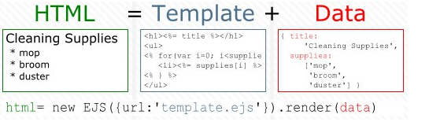
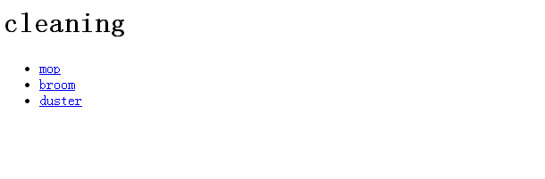

## EJS模板
### 一. 为什么要使用EJS
使用js只接生成前端代码比较麻烦. EJS可以将要生成的页面分为ejs模板和JSON数据两部分. 前端完成EJS模板,后端完成JSON, 进而实现前后端分离.如下图:

#### 举例:生成如下页面

- 方法一:使用JavaScript生成前端页面
```
var html = "<h1>"+data.title+"</h1>";
    html += "<ul>"; 
    for(var i=0; i<data.supplies.length; i++) {
        html += "<li><a href='supplies/"+data.supplies[i]+"'>";
        html += data.supplies[i]+"</a></li>"; 
    } 
    html += "</ul>";
```
- 方法二: 使用EJS+JSON
```
//JSON代码
{
    title:"Cleaning",
    supplies:[
        "mop",
        "broom",
        "duster"
    ]
}
//EJS代码
<h1>
```